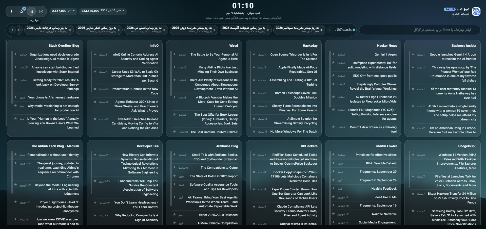

# نیوز تب



افزونه کروم صفحه تب جدید را با فیدهای RSS دلخواه شما به یک مرکز خبری شخصی‌سازی‌شده تبدیل می‌کند.

[](https://github.com/Amirrezaheydari81/NewsTab)
[](https://developer.chrome.com/docs/extensions/mv3/)
[](LICENSE)
[](https://github.com/Amirrezaheydari81/NewsTab)

**مخزن:** [github.com/Amirrezaheydari81/NewsTab](https://github.com/Amirrezaheydari81/NewsTab)

## ویژگی‌ها

### خبر و فید
- **فیدهای RSS نامحدود** — افزودن، حذف و جابه‌جایی فیدها از تنظیمات
- **تا ۱۰ خبر در هر فید** — تیترها از جدید به قدیم، با تاریخ انتشار جمع‌وجور
- **کش یک‌ساعته** — جلوگیری از درخواست‌های تکراری؛ در حالت کم‌مصرف هر ۲ ساعت
- **مرتب‌سازی بر اساس تازه‌ترین سایت** — کارت فیدهایی که جدیدترین خبر را دارند بالاتر می‌آید
- **ترجمه خودکار فارسی** — تیترها را به فارسی ترجمه می‌کند
- **علامت‌گذاری خوانده‌شده** — لینک‌های بازشده به‌صورت خوانده‌شده ذخیره می‌شوند
- **گروه‌بندی فیدها** — فیدهای هم‌نام در گروه‌های جدا؛ جمع/باز شدن گروه ذخیره می‌شود
- **ذخیره خبرها** — ستاره روی تیترها برای نگه داشتن لینک‌های مهم (قابل خاموش‌کردن)

### چیدمان «اول خبر»
- **هدر یک‌ردیفه** — لوگو، ساعت + خوشامد + تاریخ، نقل‌قول کوتاه، قیمت دلار/طلا
- **دکمه‌های هدر** — کارهای امروز، میانبرها و ذخیره‌ها به‌صورت پاپ‌اوور (بدون اشغال دائم صفحه)
- **جستجوی واحد** — تایپ = فیلتر تیترها؛ Enter = جستجو در گوگل (قابل خاموش‌کردن)
- **نوار وضعیت گوگل** — اسکرول افقی راست‌چین با پاپ‌آپ جزئیات ترجمه‌شده
- **منوی کوتاه ⋮** — به‌روزرسانی، ترجمه، پوسته، تنظیمات
- **تنظیمات سه‌تب** — نمایش / فیدها / داده و پشتیبان

### قابلیت‌های قابل خاموش‌کردن
| قابلیت | توضیح |
|--------|--------|
| خوشامدگویی | صبح بخیر / روز بخیر / … کنار ساعت |
| جمله انگیزشی | نقل‌قول کوتاه زیر خوشامد |
| قیمت‌ها | دلار و طلا (tgju) |
| وضعیت گوگل | آپدیت‌های Search Status با ترجمه فارسی |
| جستجوی گوگل با Enter | همان جعبه فیلتر |
| کارهای روزانه | لیست کار امروز با تشویق و کانفتی |
| میانبرها | Search Console، Analytics، AI و … |
| ذخیره خبرها | دکمه ★ روی تیترها |
| پوسته | سیستم / روشن / تیره |

### امنیت و داده
- فقط لینک‌های `https` برای فید، ذخیره‌ها و میانبرها
- جداسازی **پاکسازی کش موقت** از داده کاربر (فیدها، todos، ذخیره‌ها پاک نمی‌شوند)
- **خروجی / بازیابی پشتیبان** با رمز اختیاری (AES-GCM + PBKDF2)
- یادآوری بکاپ بعد از حدود ۲ هفته (نقطه روی منو)
- CSP سخت‌گیرانه MV3: `script-src 'self'`
- فونت وزیرمتن محلی از `fonts/` — بدون CDN

## نصب

### روش ۱: Developer Mode

1. مخزن را کلون یا دانلود کنید
2. در کروم بروید به `chrome://extensions/`
3. **Developer mode** را روشن کنید
4. **Load unpacked** → پوشه اصلی پروژه را انتخاب کنید

### روش ۲: بیلد انتشار

```bash
npm install
npm run build
```

خروجی در `dist/` آماده بارگذاری است.

## ساختار پروژه

```
NewsTab/
├── newtab.html         # صفحه تب جدید
├── app.js              # فیدها، کش، رندر کارت‌ها، تنظیمات
├── quotes.js           # نقل‌قول انگیزشی
├── google-status.js    # وضعیت جستجوی گوگل + ترجمه
├── extras.js           # میانبرها، todos، پوسته، ذخیره، خوشامد
├── backup.js           # خروجی/بازیابی پشتیبان رمزنگاری‌شده
├── theme-init.js       # اعمال پوسته قبل از رندر (بدون فلش)
├── tgju-v2.js          # ویجت قیمت tgju
├── fonts.js / fonts.css
├── style.css           # خروجی کامپایل Tailwind
├── src/input.css       # منبع استایل Tailwind CSS 4
├── fonts/              # Vazirmatn (woff2)
├── manifest.json       # Manifest V3
├── build.js            # بیلد production
├── package.json
├── logo.png
├── cover.jpg
└── README.md
```

## توسعه

### پیش‌نیازها

- Node.js >= 18
- npm

### اسکریپت‌ها

| دستور | توضیحات |
|--------|---------|
| `npm run css` | کامپایل Tailwind → `style.css` |
| `npm run css:watch` | تماشای تغییرات CSS |
| `npm run build` | CSS + minify JS + کپی به `dist/` |
| `npm test` | تست واحد (در صورت وجود `test.js`) |

### افزودن فید

منوی ⋮ → **تنظیمات** → تب **فیدها** → نام و آدرس HTTPS فید را وارد کنید.

### پشتیبان‌گیری

منوی ⋮ → **تنظیمات** → تب **داده و پشتیبان** → در صورت نیاز رمز بگذارید → خروجی یا بازیابی از فایل JSON.

## تغییرات

### 1.2.1.0
- چیدمان «اول خبر»: هدر فشرده، پاپ‌اوور کارها/میانبرها، جستجوی واحد، پنل تنظیمات سه‌تب
- وضعیت جستجوی گوگل (اسکرول RTL + پاپ‌آپ جزئیات + ترجمه فارسی)
- میانبر ابزارها، کارهای روزانه، ذخیره خبر، خوشامدگویی، جستجوی وب، پوسته روشن/تیره/سیستم
- کش یک‌ساعته خبرها؛ پاکسازی کش جدا از داده کاربر
- خروجی/بازیابی پشتیبان با رمز اختیاری و یادآوری بکاپ
- سخت‌گیری URL (فقط HTTPS) و CSP

### 1.2.0.0
- بازطراحی UI با Tailwind CSS 4 و RTL
- فونت وزیرمتن محلی
- حداکثر ۱۰ خبر در هر فید؛ مرتب‌سازی بر اساس تازگی سایت
- تاریخ انتشار مینیمال کنار تیتر

## توسعه‌دهنده

امیررضا حیدری  
[https://github.com/Amirrezaheydari81/](https://github.com/Amirrezaheydari81/)

## مجوز

MIT
